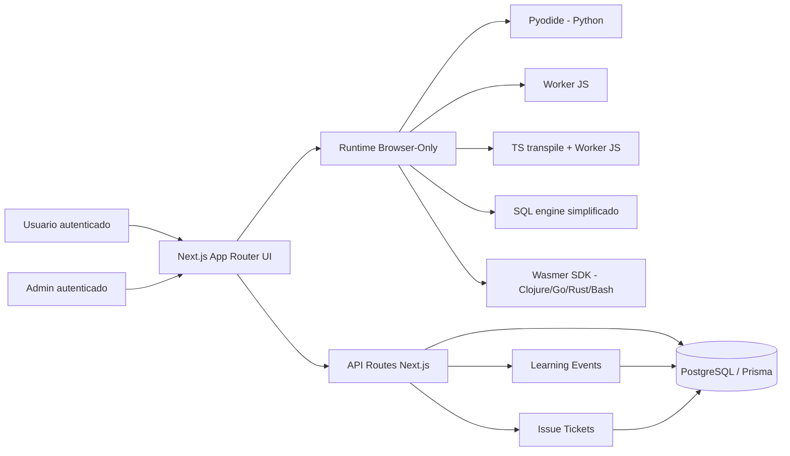
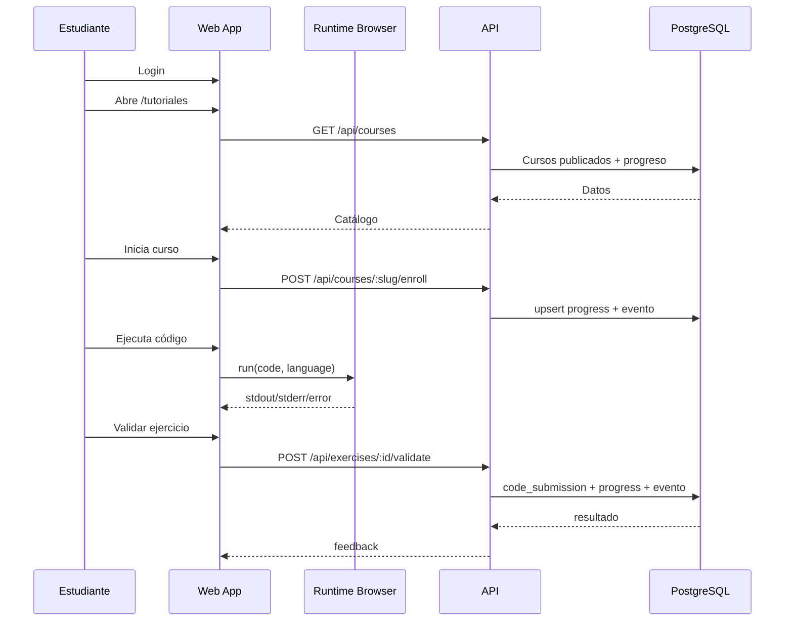
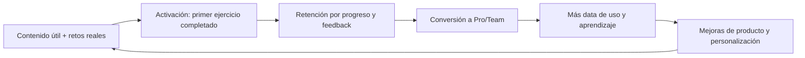

# Plataforma de Aprendizaje Interactivo Browser-Only

Plataforma educativa full-stack para aprender programación con cursos interactivos, ejecución de código en navegador, panel admin, analítica en tiempo casi real y sistema de tickets de mejora/incidencias.

## Estado actual (24 de febrero de 2026)

- 8 lenguajes habilitados: Python, Clojure, JavaScript, TypeScript, SQL, Go, Rust y Bash.
- Acceso a cursos protegido por autenticación (`/tutoriales` requiere sesión).
- Panel admin con CRUD de cursos/lecciones/ejercicios, anuncios, usuarios, analítica y tickets.
- Botón flotante de reporte en tutoriales y admin para crear tickets.
- Runtimes browser-only por lenguaje (sin backend de ejecución de código).
- Calidad validada:
  - Unit tests: `260/260` pasando
  - Coverage: `98.76%` líneas
  - E2E: `41/41` escenarios pasando

---

## Qué incluye la plataforma (visión general)

### Para estudiantes

- Catálogo de cursos por lenguaje con ruta guiada.
- Lecciones con contenido + ejercicios prácticos.
- Editor Monaco con ejecución y salida en vivo.
- Validación de ejercicios y avance de progreso.
- Feedback de ejercicios (rating + comentario).
- Reporte de incidencias/mejoras desde cualquier tutorial.

### Para administradores

- Gestión de cursos, lecciones y ejercicios con publicación controlada.
- Configuración por curso de `language` y `runtimeType`.
- `ExerciseBuilder` adaptado automáticamente al lenguaje del curso.
- Gestión de anuncios del sistema.
- Dashboard con métricas globales y analítica de aprendizaje.
- Monitoreo casi en vivo de eventos de uso.
- Bandeja de tickets con triage manual (estado, severidad, notas).

---

## Imagen general de arquitectura



---

## Flujo funcional end-to-end



---

## Arquitectura técnica (detalle)

### Stack principal

- Frontend/App: Next.js 14 (App Router), React 18, TypeScript.
- UI/UX: Tailwind CSS, Framer Motion, Radix UI.
- Editor: Monaco Editor.
- Auth: NextAuth v5 + Prisma Adapter + credenciales.
- DB: PostgreSQL (Neon) con Prisma ORM.
- Validación: Zod + React Hook Form.
- Analítica visual: Recharts.
- Testing: Vitest + React Testing Library + Playwright.

### Ejecución de código por lenguaje (browser-only)

| Lenguaje | RuntimeType | Motor actual | Estado |
|---|---|---|---|
| Python | `browser_pyodide` | Pyodide WASM | Estable para ejercicios intro/intermedios |
| JavaScript | `browser_javascript` | Web Worker + `new Function` | Estable |
| TypeScript | `browser_typescript` | `typescript.transpileModule` + Worker JS | Estable (sin type-checking estricto en runtime) |
| SQL | `browser_sql` | Evaluador SQL simplificado | Limitado (principalmente `SELECT` expresiones) |
| Clojure | `browser_clojure` | Wasmer SDK (paquete configurable) | Requiere `NEXT_PUBLIC_WASMER_CLOJURE_PACKAGE` |
| Go | `browser_go` | Wasmer SDK | Funcional |
| Rust | `browser_rust` | Wasmer SDK (paquete configurable) | Requiere `NEXT_PUBLIC_WASMER_RUST_PACKAGE` |
| Bash | `browser_bash` | Wasmer SDK | Funcional |

### Lógica de aprendizaje

- `Progress` se registra al abrir/iniciar lección y se marca `completed` al validar correcto.
- `CodeSubmission` guarda intentos, salida y feedback.
- `LearningEvent` captura eventos clave (`course_enrolled`, `lesson_viewed`, `exercise_validated`, etc.).

### Sistema de tickets

- FAB flotante en tutoriales y admin (`IssueReportFab`).
- Endpoint usuario autenticado: `POST /api/tickets`.
- Dashboard admin:
  - `GET /api/admin/tickets` (filtros)
  - `PATCH /api/admin/tickets/[id]` (estado/severidad/notas)
- Triage manual por severidad y estado.

### Seguridad y control de acceso

- Middleware protege:
  - `/tutoriales/**` (requiere sesión)
  - `/dashboard/**` (requiere sesión)
  - `/admin/**` (requiere rol admin)
- Headers de seguridad activos en `next.config.js`:
  - `COOP`, `COEP`, `X-Frame-Options`, `nosniff`, `Referrer-Policy`.

---

## Modelo de datos principal

- `User`: cuentas, rol, sesiones.
- `Course`: curso, lenguaje, runtime.
- `Lesson`: lecciones publicadas por curso.
- `Exercise`: ejercicios, starter/solution, test cases, hints.
- `Progress`: avance por usuario/lección.
- `CodeSubmission`: envíos y resultado.
- `LearningEvent`: telemetría de aprendizaje.
- `Announcement`: comunicaciones del sistema.
- `IssueTicket`: incidencias/mejoras reportadas.
- `Subscription`: base para monetización.

---

## Calidad y pruebas

### Comandos

```bash
pnpm lint
pnpm exec tsc --noEmit
pnpm exec vitest run --coverage
pnpm test:e2e
```

### Resultado validado

- Unit/integration: `260/260` tests.
- Coverage: `98.76%` líneas.
- E2E (Playwright): `41/41` escenarios.

---

## Instalación y ejecución local

```bash
pnpm install
cp .env.example .env
pnpm db:generate
pnpm db:migrate
pnpm db:seed
pnpm dev
```

App local: [http://localhost:3000](http://localhost:3000)

---

## Backlog escalable (producto + tecnología)

## Horizonte 0-3 meses

- Integrar linters reales por lenguaje:
  - Python (`ruff`/`pyright` en modo browser-compatible donde aplique)
  - JS/TS (`eslint`/`typescript diagnostics`)
  - SQL parser robusto
  - ShellCheck-like para Bash
- Motor SQL completo en WASM (SQLite/DuckDB) en lugar del evaluador simplificado.
- Paquetes/runtime versionados para Clojure/Rust (catálogo interno de runtimes).
- Observabilidad operativa (Sentry + trazas por endpoint).
- Hardening de validación de ejercicios (sandboxing y límites de recursos por runtime).

## Horizonte 3-6 meses

- Tracks de Data Science (Python + SQL + notebooks browser-only).
- Roles y permisos más granulares en admin.
- Segmentación avanzada de anuncios y campañas in-app.
- Certificados verificables por ruta/curso.
- Soporte multi-idioma (ES/EN/PT).

## Horizonte 6-12 meses

- Modo Team/Enterprise multi-tenant.
- LMS integrations (LTI/SCORM/xAPI opcional).
- Marketplace de cursos de terceros con revenue-share.
- Motor adaptativo de recomendación de lecciones según desempeño.

---

## Go-to-market: escenarios de marketing

### Escenario A: B2C self-serve (LatAm devs y estudiantes)

- ICP: estudiantes STEM, career-switchers, dev junior.
- Canal principal: contenido orgánico (YouTube, X, TikTok, blog técnico, SEO).
- Oferta: cursos interactivos browser-only + rutas guiadas por stack.
- KPI foco: Visitor -> Registro -> Primer ejercicio completado -> Suscripción.

### Escenario B: B2B Team Plan (startups y pymes)

- ICP: equipos de ingeniería/data de 5-100 personas.
- Canal principal: outbound consultivo + partnerships + webinars.
- Oferta: espacios de equipo, reportes, rutas por rol, admin seat.
- KPI foco: demos agendadas, tasa de cierre, expansión por seats.

### Escenario C: Instituciones educativas / bootcamps

- ICP: universidades, academias, bootcamps.
- Canal principal: acuerdos institucionales + pilotos de cohorte.
- Oferta: licencias por cohorte + analítica docente + contenido personalizado.
- KPI foco: retención por cohorte, completion rate, renovación anual.

---

## Estrategia de monetización

### Propuesta de pricing inicial (recomendada)

| Plan | Precio sugerido | Público | Incluye |
|---|---:|---|---|
| Free | $0 | Descubrimiento | acceso limitado, progreso básico |
| Pro | $19/mes | B2C | catálogo completo, certificaciones, feedback avanzado |
| Pro Annual | $180/año | B2C | equivalente $15/mes |
| Team | $25/usuario/mes (anual) | B2B | admin de equipo, reportes, gestión de usuarios |
| Enterprise | custom | B2B/Institucional | SSO, SLA, soporte y contenido a medida |

### Monetización adicional

- Certificación proctored/capstone (fee por intento).
- Mentorías 1:1 o cohortes premium.
- Patrocinios de empresas hiring-partner.
- Revenue share con creadores de cursos.

---

## Business case (12 meses)

### Supuestos base

- Conversión free -> paid: 2% (conservador), 3.5% (base), 5% (agresivo).
- ARPPU B2C estimado: $16-$22/mes según mix mensual/anual.
- Margen bruto objetivo: >80% (infra browser-first + SaaS).

### Proyección simplificada

| Escenario | MAU | Paid conversion | Paid users | ARPPU | MRR estimado |
|---|---:|---:|---:|---:|---:|
| Conservador | 8,000 | 2.0% | 160 | $16 | $2,560 |
| Base | 20,000 | 3.5% | 700 | $18 | $12,600 |
| Agresivo | 50,000 | 5.0% | 2,500 | $22 | $55,000 |

Si se agrega componente B2B (ej. 10 equipos de 20 seats a $25/seat/mes), se suman ~$5,000 MRR.

### Outcome posible

- 0-6 meses: PMF temprano en 1-2 segmentos (Python/Data + JS/TS).
- 6-12 meses: negocio mixto B2C + primeros contratos Team.
- 12-18 meses: crecimiento predecible con expansión de contenido y retención.

---

## Flywheel de crecimiento



---

## Riesgos principales y mitigación

- Complejidad de runtimes browser-only multi-lenguaje.
  - Mitigación: versionado de paquetes WASM + pruebas smoke por lenguaje en CI.
- Validación inconsistente entre lenguajes.
  - Mitigación: contrato unificado de test cases + harness por runtime.
- Dependencia de adquisición orgánica lenta.
  - Mitigación: estrategia híbrida (SEO + partnerships + B2B outbound).
- Soporte de librerías pesadas (ej. ciencia de datos).
  - Mitigación: catálogo curado de paquetes, lazy loading y límites de memoria.

---

## Benchmarks externos de referencia (mercado)

- Codecademy pricing (planes individuales):
  - [Codecademy Pricing](https://www.codecademy.com/pricing)
- DataCamp pricing (Basic/Premium/Teams):
  - [DataCamp Pricing](https://www.datacamp.com/pricing)
- Coursera Plus (ejemplo de referencia pública):
  - [Coursera Plus](https://www.coursera.org/collections/coursera-plus-landing-page-april-2024)
- Demanda laboral tech (EE.UU.):
  - [BLS Software Developers Outlook](https://www.bls.gov/ooh/computer-and-information-technology/software-developers.htm)
- Brecha de skills y upskilling:
  - [WEF Future of Jobs 2025](https://www.weforum.org/publications/the-future-of-jobs-report-2025/)

> Nota: precios y benchmarks cambian con frecuencia; revisar trimestralmente antes de decisiones comerciales.

---

## Próximas implementaciones recomendadas (prioridad alta)

1. Linters y diagnósticos reales por lenguaje en editor.
2. SQL runtime completo (SQLite/DuckDB WASM).
3. Paquetes WASM internos para Clojure/Rust con fallback robusto.
4. Módulo de suscripciones completo (billing, dunning, upgrade/downgrade).
5. Dashboards de cohorte y retención (D1, D7, D30) para decisiones de crecimiento.

---

## Licencia

MIT
