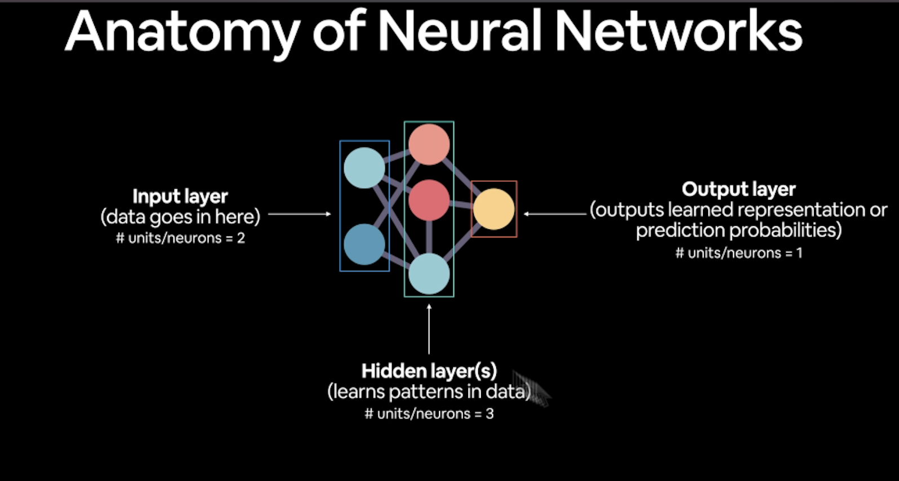

## ¿Por qué usar ML o DeepLearning?

¿En un problema complejo podemos pensar todas las reglas que satisfacen la solución del mismo?

Cualquier problema que se puede traducir en números puede tener una solución de ML, sin embargo, si se puede construir un sistema basado en reglas, un sistema que no necesita ML, es mejor hacerlo sin ML. 

Cosas para las cuales ML es bueno:

- El ML es especialmente bueno para problemas con muchas reglas, por ejemplo, coches que se manejan solos.
- También es mejor idea tener un sistema de ML en problemas que cambian continuamente, así los modelos se adaptan a esos nuevos escenarios.
- Por último, ML es muy bueno para descubrir nuevos insights de una colección de datos gigante.

Cosas para las cuales ML es tipicamente no tan bueno:

- Cuando se necesita explicabilidad, los patrones aprendidos por un modelo de deeplearning son tipicamente ininterpretables por humanos
- Cuando la solución tradicional es mejor opción, si se puede completar una tarea con un sistema basado en reglas, es mejor irse por ese camino
- Cuando los errores son inaceptables, es decir, dado que los modelos de ML y deeplearning son modelos de análisis predictivo, las predicciones siempre van a tener un error asociado
- Cuando no existe mucha data, los modelos de deeplearning usualmente requieren una cantidad bastante grande de datos para producir un resultado bueno (aunque hay maneras para sortear este problema)

## Machine Learning vs. DeepLearning

Típicamente el Machine Learning (ML) se utiliza para data estructurada, es decir, tablas con relaciones, filas y columnas, bases de datos relacionales del tipo SQL.
El DeepLearning (DL) es usado para data no estructurada, es decir, imágenes, texto, audio, etc.
Esto, sin embargo, no es una regla, hay situaciones donde el DL es mejor que ML para datos estructurados y viceversa.

Algunos algoritmos típicos para el ML son:

- Random fores
- Gradient boosted models
- Naive Bayes
- Nearest neighbour
- Support vector machine

y desde la introducción del DL, a estos modelos se les llama “shallow algorithms”, los algoritmos más populares para el DL son:

- Neural networks
- Fully connected neural networks
- Convolutional neural networks (CNN)
- Recurrent neural networks (RNN)
- Transformers, entre otros

En este tutorial nos centraremos en los fundamentos, es decir, neural networks, fully connected neural networks y convolutional neural networks, con estos tres modelos podemos crear los modelos de RNN y Transformers.

## ¿Qué es una red neuronal?

El proceso general de cómo funciona una red neuronal es el siguiente: 

1. Un input (cualquiera que este sea), se hace un numerical encoding (transformación numérica, para representarlo en números)
2. El modelo (red neuronal) aprende esa representación por si misma (patterns, features, weights)
3. Nos regresa una representación numérica de ese output
4. Por último transformamos esa representación numérica en un output humanamente legible, por ejemplo, una decisión, una imagen, un texto, etcétera. 

La anatomía de una red neuronal está compuesta de 3 elementos:

1. Input layer: la capa donde entra la data numérica
2. Hidden layers: Acá la red neuronal aprende los patrones en la data
3. Output layer: Regresa el resultado de aprender la representación de la data o la predicción de probabilidades
    
    
    

Cada layer es una combinación linear y/o no lineal de funciones. El término patterns hace referencia a palabras similares como “embedding”, “weights”, “feature representation”, “feature vectors”.

## Tipos de aprendizaje

Existen varios paradigmas de cómo una red neuronal aprende, esencialmente hay tres formas:

- Supervised Learning: Tenemos inputs y muchos ejemplos de cómo el output debería ser, es decir, labels
- Unsupervised & Self-supervised Learning: No tenemos el cómo el output debería ser, es decir, nuestra data no tiene labels, la red neuronal aprende a diferenciar los patrones, sólo aprende de la data.
- Transfer Learning: Toma los patrones que un modelo ha aprendido y se los da a otro modelo.
- Reinforcement Learning: Un agente (red neuronal) aprende a partir del contexto y se castiga o premia de acuerdo a una decision que el mismo agente haga.

## Para qué se usa el Deep Learning

- Sistemas de recomendación
- Sequence to sequence (sec2sec)
    - Traducción de idiomas
    - Speech recognition
- Classification/regration
    - Visión computacional
    - Natural Language Processing (NLP)

## ¿Qué es y por qué usar PyTorch?

- Es el framework más popular para hacer investigación en DL
- Hecho para hacer código en python rápido y que corra en paralelo
- tiene muchos modelos prehechos
- Stack completo: preprocesa la data, la modela y hace el deploy
- Originalmente hecho para y por Facebook pero ahora lo usan Tesla, Microsoft, OpenAI

## ¿Qué es un tensor?

Un esencia es una matriz multidimensional que se usa para representar estructuras de datos complejas.

En el contexto que nos interesa, los tensores se usan para representar las entradas, salidas y pesos de las redes neuronales.

referencias:
1. [https://developers.google.com/machine-learning/guides/rules-of-ml?hl=es-419#:~:text=Rule %231%3A Don't,will likely underperform basic heuristics](https://developers.google.com/machine-learning/guides/rules-of-ml?hl=es-419#:~:text=Rule%20%231%3A%20Don't,will%20likely%20underperform%20basic%20heuristics).